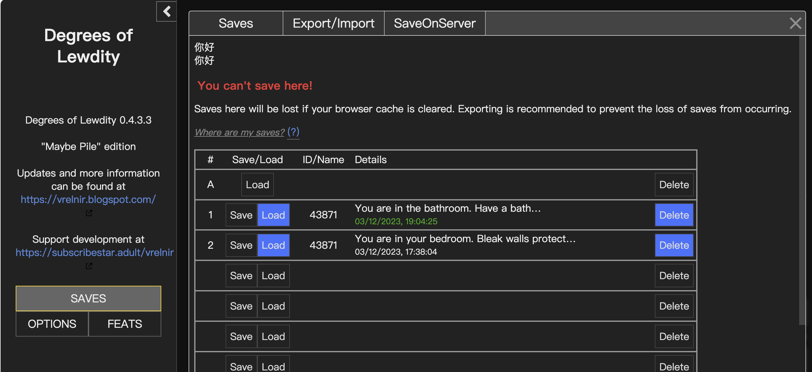

# Dol-Archive-Server

## Description
This is a simple archive server for the [Degrees of Lewdity](https://gitgud.io/Vrelnir/degrees-of-lewdity),which needs to be used in conjunction with [MinIO](https://min.io/)and the modified source code[Files · gameServer · Sn1waR / Degrees of Lewdity · GitLab (gitgud.io)](https://gitgud.io/snowywar/degrees-of-lewdity/-/tree/gameServer?ref_type=heads). You just need to deploy it on your personal server, and then you can synchronize your progress on any PC, mobile phone or other browsers.

Golang Version: 1.20+
## How to use

Deploy your minio, or other s3 storage buckets, and then modify the endpoint, access key, and secret key in the config.yaml. It will automatically create the corresponding storage buckets.


I have already integrated and compiled a version of the modified code into dol.html, you just need to compile it directly. You can view the specific project code at: https://gitgud.io/snowywar/degrees-of-lewdity/-/tree/gameServer?ref_type=heads

```
<TEXT>
go mod init
go run main.go
```

It will run on port 8080 of the server. When accessed, it will display authentication content, and you will also see related configurations in config.yaml.

The default is admin:admin


After filling in correctly, it will redirect to the game page



A new SaveOnServer button will be added on the Saves page, where you can normally manage your saves and data.

They will be uploaded and stored in your bucket.

## Why do we need a server-side?

The original game is based on twinejs, one of its design concepts is to be independent of the server. Since it doesn't have authentication functionality, it can't verify who is calling the save when it's on the cloud server. Of course, my implementation just added an entrance authentication, it still can't realize the function of one game recording multiple players' saves.

Moreover, if the compiled html is hosted to web services like nginx, there is no way to implement file read and write on the server.

Twinejs doesn't seem to come with http communication like axios, so I can only use fetch to implement request read and write to the save server. However, when a standalone html makes a request, it will encounter CSP (Content Security Policy) issues. Therefore, I can only encapsulate this file under other engines for implementation.
